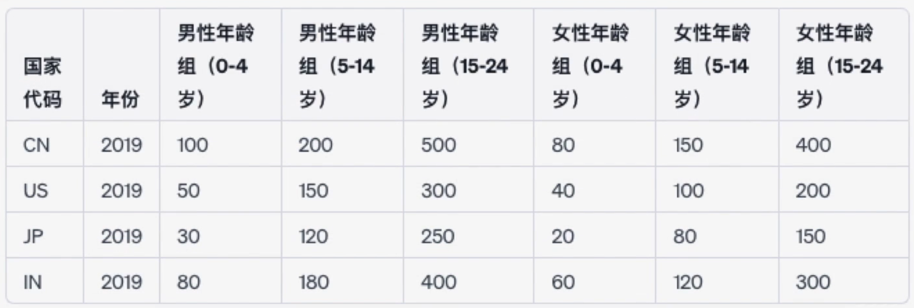
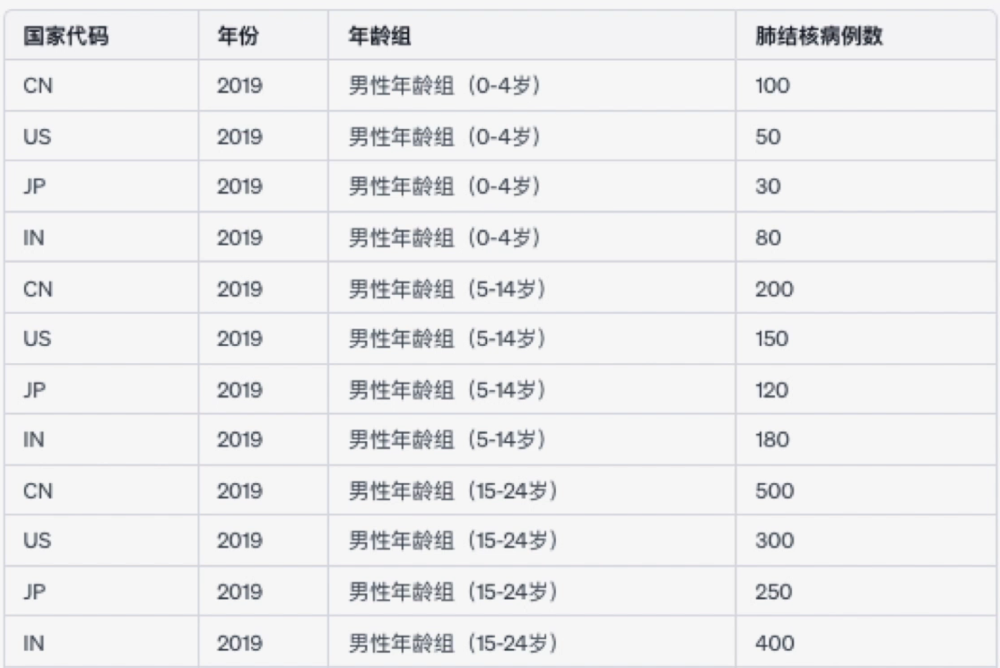

在開始分析數據之前，一個必要的步驟就是清洗數據，避免我們用有問題的數據分析出有問題的結果。那問題是如何評估數據的好壞呢？評估數據的時候主要觀察兩點：

1. 數據的結構
2. 數據的內容

## 好的數據結構/整潔的數據

一個擁有好的結構的數據應該具備以下三個特點：

1. 每一個 column 只有一個變量
2. 每一個 row 是一個觀察值
3. 每一個單元格是一個值

沒有擁有好的結構的數據被稱為亂數據。

某些表格可能看起來是結構的，例如下表代表不同年齡罹患肺結核的病例數：

但實際上他違反了“每一個 column 只有一個變量”這個原則，因為所有類似“男性年齡組（0-4歲）”的 column 都包含了兩個變量，一個是年齡組，另外一個是病例數。所以一個好的結構應該如下：

或許並沒有上面的表容易閱讀和理解，但把數據變得更有結構的目的是為了能夠更好地用程式分析數據，而不是閱讀。

## 好的數據內容/乾淨數據

一個擁有好的數據內容的數據集就叫乾淨數據，反之叫做髒數據。髒數據可能有幾個特點：

1. 丟失數據
2. 重複數據
3. 不一致數據
4. 無效和錯誤數據

第三點需要說明一下，不一致數據指的是，同一個 column 內代表一樣的數據卻有不同的表達方法，例如某些同學來自第一班，但數據內卻有"一班"，"第一班"，"1班"等不同表達，這就是不一致的數據。
